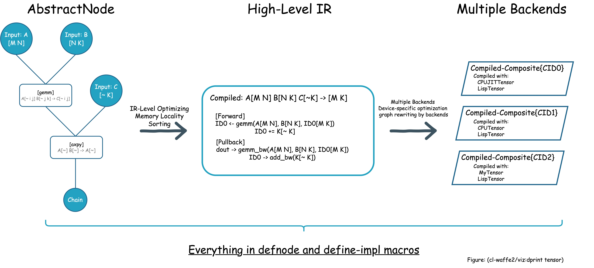

<p align="center">
    <a href="https://github.com/hikettei/cl-waffe2">
        
    </a>
    <br>
    <h3 align="center">Programmable Deep Learning Framework</h3>
    <p align="center">
    <a href="https://hikettei.github.io/cl-waffe2/"><strong>Visit the docs »</strong></a>
    <br />
    <br />
    <a href="https://github.com/hikettei/cl-waffe2/blob/master/docs/cl-waffe2-docs/docs/overview.md">Concepts</a>
    ·
    <a href="https://hikettei.github.io/cl-waffe2/install/">Install</a>
    ·
    <a href="https://github.com/hikettei/cl-waffe2/tree/master/examples">Examples</a>
  </p>
</p>

[](https://github.com/hikettei/cl-waffe2/actions/workflows/Cl.yml)

# cl-waffe2



> ⚠️ cl-waffe2 is still in the experimental stage. Things are subject to change, and APIs can be changed without warnings. DO NOT USE CL-WAFFE2 IN YOUR PRODUCT.
> 
> I actually have a repository [cl-waffe(DEPRECATED UNSUPPORTED!)](https://github.com/hikettei/cl-waffe) with a similar name. Don't misunderstand that: cl-waffe**2** is the latest one and all features are inherited from the old one.

cl-waffe2 provides fast, systematic, easy to optimize, customizable, and environment- and device- independent abstract matrix operations, and reverse mode tape-based Automatic Differentiation on Common Lisp. Plus, we also provide features for building and training neural network models, accelerated by JIT Compiler.

Roughly speaking, this is a framework for the graph and tensor abstraction without overheads. All features provided here can be extended by users without exception. And with the minimal code. In fact, cl-waffe2 is designed as the truly easiest framework to write extensions by users. There's no barrier between users and developers. There's no restriction imposed by framework ignoring the developing language is limited to Common Lisp.

Its abstraction layers are almost reaching the goals and working enough, but there is still a serious lack of backend functionality, and documentations. Contributions are welcome and I would appreciate if somebody who is interested in by project contact me: [hikettei](https://github.com/hikettei).

## ✨Features

- **Abstraction** cl-waffe2 brings **AbstractTensor** (and AbstractNode!) to Common Lisp.
- **Extensible** All operations can be reimplemented with any matrix operation libraries you like! Plus, AbstractNode guarantees that no code rewriting is needed when changing devices.
- **Inlining**  Anyone can write an optimized loop calling foreign libraries; an order is collapsed and shuffled depending on the ranks and offsets. 
- **Graph-Level Optimization** cl-waffe2 provides a powerful abstract graph optimization tool that can be used on any devices. For example, it optimizes the locality of memory, and make operations in-place as much as possible.
- **Visualize** Super easy to know the bottleneck in your network, because a `proceed-bench` function profiles every instruction.
- **Debugging** cl-waffe2 is enough clever that not only detecting all Shaping-Error before the execution but also suggests alternatives! In addition, All objects in cl-waffe2 are nicely rendered on your REPL.
- **Systematic Nodes**: AbstractNodes and Models are written with small codes.
- **Symbolic Differentiation** In the first place, cl-waffe2 do not create nodes that are later modified. Compiler macros eliminate functions producing such nodes.

## 🍃 Quicklook

In the simplest example, the `build` function traces and compiles the network from the endpoints of the computation nodes. 

Example1. Compiling a node

```lisp
(let ((a (make-input `(A B) :A))
      (b (make-input `(A B) :B)))
  (let ((model (build (!sum (!mul a b)) :inputs `(:A :B))))
    (print model)
    ;; model is a compiled function: f(a b)
    (forward model (randn `(3 3)) (randn `(3 3)))))

;;<Compiled-Composite(allocated-p=NIL)
;;    forward     : forward(model A B) -> CPUTENSOR{FLOAT}(1 1)
;;    backward    : backward(model) -> t
;;    memory-pool : two tensor(s)
;;                   L {8.0e-6+((A B) x 4.0e-6)}MB
;;    inputs:
;;        A -> (A B)
;;        B -> (A B)
;;> 

;;{CPUTENSOR[float] :shape (1 1) -> :view (<(BROADCAST 1)> <(BROADCAST 1)>) -> :visible-shape (1 1) :named ChainTMP646587 
;;  ((1.0858848))
;;  :facet :input
;;  :requires-grad NIL
;;  :backward NIL} 
```

The advantages of using Common Lisp are numerous:
- The shape of the tensors is not limited to numbers, but can also include symbols and even **S-expressions**!
- Automatic Generation of Iterators, ShapeError, etc.
- Works as a Domain Specific Language for Deep Learning embedded in Common Lisp

Example2. MLP Model

```lisp
;; From https://github.com/hikettei/cl-waffe2/blob/master/examples/mnist/mlp.lisp
(defsequence MLP (in-features hidden-dim out-features
			   &key (activation #'!relu))
	     "Three Layers MLP Model"
	     (LinearLayer in-features hidden-dim)
	     (asnode activation)
	     (LinearLayer hidden-dim hidden-dim)
	     (asnode activation)
	     (LinearLayer hidden-dim out-features))

(defun build-mlp-model (in-class out-class &key (hidden-size 256) (activation #'!relu) (lr 1e-3))
  (let* ((mlp (MLP in-class hidden-size out-class :activation activation))
	 (lazy-loss (criterion #'softmax-cross-entropy
			       (call mlp
				     (make-input `(batch-size ,in-class) :X))
			       (make-input `(batch-size ,out-class) :Y)
			       :reductions (list #'!sum #'->scal)))
	 (model     (build lazy-loss :inputs `(:X :Y))))
    (mapc (hooker x (Adam x :lr lr)) (model-parameters model))
    (values model mlp)))

(defun step-train-mlp (model x y)
  (let ((act-loss (forward model x y)))
    (backward model)
    (mapc #'call-optimizer! (model-parameters model))
    (/ (tensor-vec act-loss) 100)))

(defmethod accuracy ((model MLP) x y)
  (let* ((out   (!argmax (call model x)))
	 (label (!argmax y))
	 (total (proceed (->scal (!sum (A=B out label))))))
    (float (/ (tensor-vec total) (nth 0 (shape out))))))
```

Example3. reshape and transform

```lisp
(!reshape (make-input `(N C H W) nil) (~ N C H W -> (* N C H) W))
(%transform (ax+b `(3) 1 0)[i] -> [~ i])
```

We also provide [example projects](https://github.com/hikettei/cl-waffe2/tree/master/examples) here!

# 📈 Performance

Don't underestimate the power of lazy evaluation. Nodes are first converted to fully optimized IRs before doing forward and backward propagations. 

Since cl-waffe2 is still under development, there are still many optimization techniques remains to be implemented. Even these benchmarks were measured under single-core but shows enough performance!

## MLP

### optimizers=Adam, hidden_size=256

n_epoch |  cl-waffe2 | Keras | PyTorch | JAX |
--------|------------|-------|---------|-----|
1|3.111s|3.662s|3.418|4.039s
10|32.437s|31.352s|28.403s|30.801s
100| 304.864s | 274.854s | 338.031s | 275.875s

### optimizers=Adam hidden=512

n_epoch |  cl-waffe2 | Keras | PyTorch | JAX |
--------|------------|-------|---------|-----|
1| 6.075s | 7.55s | 7.29s | 6.90s 
10| 61.703s | 56.283s | 51.140s | 65.682s

## ResNet18

(Coming Soon...)

## Text Generation

(Coming Soon...)

# 📕 References and Acknowledgments

- All comments on this Reddit post: [Does anyone have any interest in my deep-learning framework?](https://www.reddit.com/r/Common_Lisp/comments/124da1l/does_anyone_have_any_interest_in_my_deeplearning/).

- digikar99 for giving me intriguing perspectives on some semantics and the publication of a large number of valuable references.
    - [Features of Common Lispy approach to (Better) Numpy](https://gist.github.com/digikar99/ba2f0bb34021bfdc086b9c1c712ca228)

- [Rationalized APL](https://www.jsoftware.com/papers/RationalizedAPL.htm)

- [Previous research of Petalisp](https://www.european-lisp-symposium.org/static/2018/heisig.pdf)
    - https://github.com/marcoheisig/Petalisp/tree/master

- [Automatic differentiation in machine learning: a survey](https://arxiv.org/abs/1502.05767)

- Some of the algorithms implemented within the source code are referenced below:

    - https://arxiv.org/pdf/1201.6035.pdf

    - https://github.com/melisgl/mgl-mat

    - https://dl.acm.org/doi/pdf/10.1145/359460.359482

    - https://andantesoft.hatenablog.com/entry/2023/04/30/183032

    - Marsaglia, G., & Tsang, W. W. (2000). The ziggurat method for generating random variables. Journal of statistical software.

    - https://marui.hatenablog.com/entry/2023/01/23/194507

    - https://arxiv.org/abs/1912.01703

- Previous works of JIT Compiler for Deep Learning:

    - https://arxiv.org/pdf/2002.03794.pdf

    - See also my reading list: https://github.com/hikettei/cl-waffe2/issues/47
