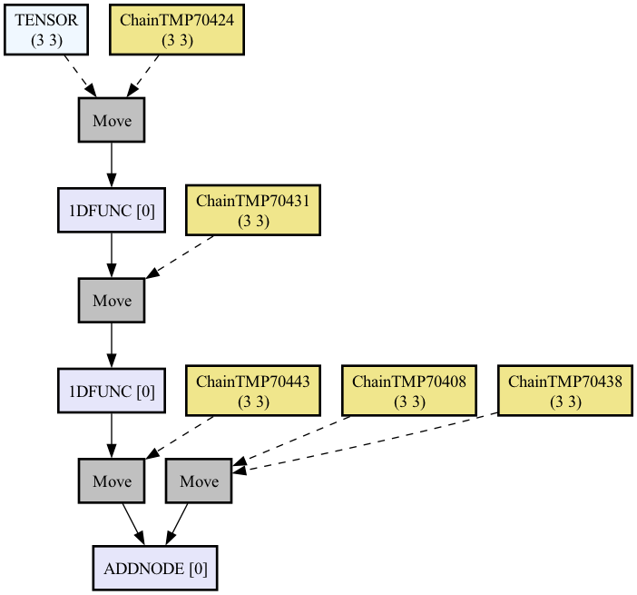
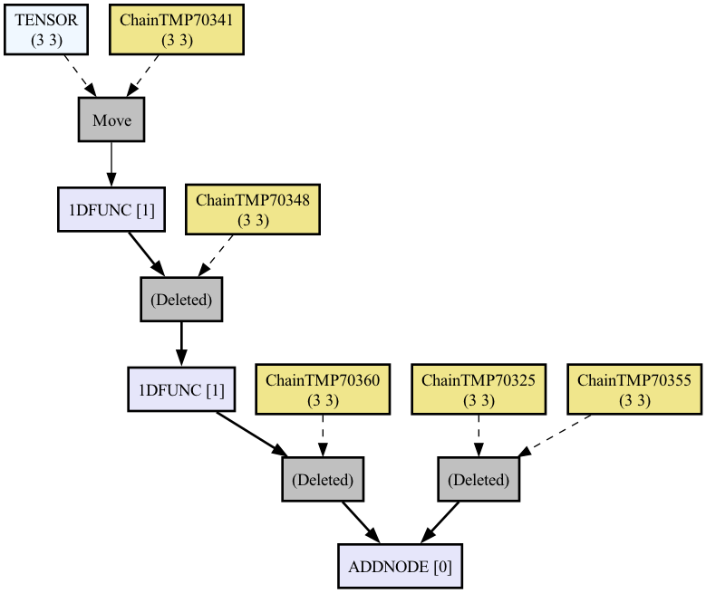

# A road to cl-waffe2

## Project Structure

Thank you for having interest in my project. Before we start the tutorial, let me explain the structure of cl-waffe2 package.

Mainly, cl-waffe2 consists of the following packages.

### Fundamental System

These two package form the basis of cl-waffe2:

```
:cl-waffe2/vm.nodes
:cl-waffe2/vm.generic-tensor
```

The package `:cl-waffe2/vm.nodes` provides a system for constructing neural networks, including `AbstractNode`, `Composite`, `Shaping API` etc...

On the other hand, `:cl-waffe2/vm.generic-tensor` provides features on `AbstractTensor`, including `JIT Compiler`, `NodeTensor`, `Memory-Pool` etc...

### Standard APIs

```lisp
(Figure: Dependencies of cl-waffe2)

                            [CPUBackend ]
            [base-impl] --- [LispBackend]
                |           [CUDABackend] ...
	            |
   [vm.generic-tensor] [vm.nodes]
   
```

```
:cl-waffe2/base-impl
```

Using the basic system of cl-waffe2, `:cl-waffe2/vm.generic-tensor` and `:cl-waffe2/vm.nodes`, the package `:cl-waffe2/base-impl` provides a standard implementation of matrix (sometimes scalar) tensor operations. The operation we say is including: `defun` parts, and abstract definition of operation.

Before we go any futher: cl-waffe2 is working on `AbstractTensor` (inspired in Julia's great idea, `AbstractArray`), which separates **implementation** of the operation from the
**definition.** In that respect, `:cl-waffe2/base-impl` provides the **definition** of operations, while the packages we about to mention provides **implementation** of operations.

### Standard Backends/Implemenetations

As of this writing (2023/07/05), we provide two standard implementation of `:cl-waffe2/base-impl`, both of them are working on CPU.

```
:cl-waffe2/backends.lisp
:cl-waffe2/backends.cpu    
```

If only time and money would permit, I'm willing to implement CUDA/Metal Backends.

:cl-waffe2/backends.lisp is `work enough` first, it is Portable (based on ANSI Common Lisp) and supports AVX2 but far from `full speed`.

On the other hand :cl-waffe2/backends.cpu is accelerated by OpenBLAS (maybe MKL is ok) and other foreign backends, this is SBCL-Dependant and sometimes could be unsafe, but provides `full speed`.


TODO:

```
:cl-waffe2/backends.fastmath (NOT IMPLEMENTED YET!)
```

(TO BE) Supporting vectorized mathematical functions, AVX512 instructions.

### Neural Network

```lisp
:cl-waffe2/nn ;; Provides Basic neural-network Implementations.
:cl-waffe2/optimizers ;; Provides Basic Optimizers
```

### Utils

```lisp
:cl-waffe2     ;; Provides multi-threading APIs and config macros!
:cl-waffe2/viz ;; Provides Vizualizing APIs of computation node
etc...
```

### To Get Started!

If you're going to start with defining a new package, It is recommended to `:use` the package to be used.

Read the description above and select and describe the packages you think you need. (or you can just copy and paste it.)

This is an example case of `:your-project-name` package.
```lisp

(in-package :cl-user)

(defpackage :your-project-name
    (:use :cl
          :cl-waffe2
	  :cl-waffe2/vm.generic-tensor
	  :cl-waffe2/vm.nodes
	  :cl-waffe2/base-impl
	  :cl-waffe2/distributions
	  :cl-waffe2/backends.lisp
	  :cl-waffe2/backends.cpu
	  :cl-waffe2/nn
	  :cl-waffe2/optimizers
	  :cl-waffe2/viz))

(in-package :your-project-name)

;; Your code follows...

```

If you're working with REPL (or new to Common Lisp?), you can try cl-waffe2 features like this:


```sh
$ ros run
> (load "cl-waffe2.asd") # cl-waffe2.asd should be placed where SBCL can read it.
> (ql:quickload :cl-waffe2)
> (in-package :cl-waffe2-repl) ;; this is a playground place, and all features are available
```

The tutorials below should be also working on REPL, (indeed, cl-waffe2 is REPL-friendly!), you can learn how cl-waffe2 works by copying and pasting the example codes.

## Basic: Building Computation Nodes Lazily

Since `Do not run until the node is optimized` is a one of cl-waffe2 policy, all operations in cl-waffe2 is lazy evaluation unless defined by a special macro.

Therefore, calling `!add` function which finds a sum of given arguments, the retuend tensor isn't still computed, but `:vec-state` = `[maybe-not-computed]`

```lisp
(!add 3.0 2.0)
```

```lisp
{SCALARTENSOR[float]  :named ChainTMP23305 
  :vec-state [maybe-not-computed]
  <<Not-Embodied (1) Tensor>>
  :facet :input
  :requires-grad NIL
  :backward <Node: SCALARANDSCALARADD-SCALARTENSOR (A[SCAL] B[SCAL] -> A[SCAL]
                                                    WHERE SCAL = 1)>}
```

`:vec-state` indicates the computation state of tensor, and it says exactly what it says.

You can continue the operation by connecting the returned tensor and next operation.

For example, the figure below in cl-waffe is representece as:

```math
out = 3 + 2 * 4
```

```lisp
(defparameter out (!add 3 (!mul 2 4))) ;; out <- 3 + 2 * 4
```

To obtain the state in which the operation is performed, calling the function `(proceed toplevel)` is a vaild option.

```lisp
(proceed out)

{SCALARTENSOR[int32]  :named ChainTMP28326 
  :vec-state [computed]
    11
  :facet :input
  :requires-grad NIL
  :backward <Node: PROCEEDNODE-T (A[~] -> A[~])>}
```

`proceed` is a differentiable operation which instantly compiles and executes all the previous node of `toplevel`. In addition, there's another way to accept nodes: `(build out)` or `(define-composite-function)`, but they're a little complicated, so explained in the other sections.

The moment compiling function is called, cl-waffe2 prunes all unused copying, computes all `View Offsets`, schedules memory allocation and (Currently it's not working though) multi-threading.

## AbstractTensor - One operation, Multiple implementations.

### Background

```lisp
(Operations in cl-waffe2)

                           [AbstractNode]
	                             |
            |--------------------|------------------------|
 [CPU Implementation1] [CPU Implementation2] [CUDA Implementation1] ...
```

`Julia` has introduced [AbstractArray](https://docs.julialang.org/en/v1/base/arrays/) in their libraries, separating the common (generic) parts of the array from each backend implementation. Since `AbstractTensor` increased portability between devices on which they run (even on CPU!), cl-waffe2 wholly introduced this feature.


In cl-waffe2, The generic definition of operations, `AbstractNode` is a class declared via the `defnode` macro, and depending on the devices we use, the `define-impl` macro defines an implementation.

Conveniently, there can be more than one implementation for a single device. (e.g.: it is possible to have a normal implementation and an approximate implementation for the exp function on single CPU).

One of the policy is to minimise code re-writing by defining abstract nodes and switching the backends that executes them depending on the device they run on and the speed required.


### Example: AddNode

Here's an example of how I've implemented the operation `!add`.

`AddNode-Revisit` is `AbstractNode` of finding the sum of two given matrices A and B and storing the result in A. Here's the segment from the source code.

```lisp
;; Reimplementation of AddNode
(defnode (AddNode-Revisit (myself dtype)
            :where (A[~] B[~] -> A[~])
	        :documentation "A <- A + B"
	        :backward ((self dout dx dy)
	                   (declare (ignore dx dy))
		               (values dout dout))))
```

`AbstractNode` is a CLOS class with the following operation.

1. shape changes before and after the operation, and which pointer to use? is described in `:where`. Before `->` clause refers to the arguments, after `->` clause refers to the shape of matrix after the operation.

It says:

1. Takes A and B as arguments and returns a matrix of pointers of A
2. All matrices have the same shape before and after the operation.

Also, `:backward` defines the operation of backward. This declaration can be made either in `defnode` or in `define-impl`, whichever you declare.

The declared node can be initialized using the function `(AddNode-Revisit dtype)`, but seems returning errors.

```lisp
(AddNode-Revisit :float)
;; -> Couldn't find any implementation of AddNode for (CPUTENSOR LISPTENSOR).
```

This is because there is not yet a single implementation for `AddNode-Revisit`.

One operation can be defined for a backend that can be declared by extending the `cl-waffe2/vm.generic-tensor:AbstractTensor` class. Here's `LispTensor`, and `CPUTensor`, and of course, if necessary, you can create a new backend like:

```lisp
(defclass MyTensor (AbstractTensor) nil)

;; Initializer/Allocator
(defmethod initialize-instance :before ((tensor MyTensor)
					&rest initargs
					&key &allow-other-keys)
  ;; if projected-p -> alloc new vec
  (let* ((shape (getf initargs :shape))
	 (dtype (dtype->lisp-type (getf initargs :dtype)))
	 (vec   (getf initargs :vec))
	 (facet (getf initargs :facet))
	 (initial-element (coerce (or (getf initargs :initial-element) 0) dtype)))
    (when (eql facet :exist)
      (if vec
	  (setf (tensor-vec tensor) vec)
	  (setf (tensor-vec tensor)
		(make-array
		 (apply #'* shape)
		 :element-type dtype
		 :initial-element initial-element))))))

;; If data storage is differ from CL Array, override vref and (setf vref) method.
```

(See also: [tensor.lisp](https://github.com/hikettei/cl-waffe2/blob/master/source/backends/lisp/tensor.lisp))

The devices to use can be switched `with-devices` macro.

```lisp
(with-devices (MyTensor LispTensor) ;; The further to the left, the higher the priority.
    (make-tensor `(10 10)))

;; -> MyTensor is created
{MYTENSOR[float] :shape (10 10)  
  ((0.0 0.0 0.0 ~ 0.0 0.0 0.0)           
   (0.0 0.0 0.0 ~ 0.0 0.0 0.0)   
        ...
   (0.0 0.0 0.0 ~ 0.0 0.0 0.0)
   (0.0 0.0 0.0 ~ 0.0 0.0 0.0))
  :facet :exist
  :requires-grad NIL
  :backward NIL}
```

`MyTensor` has no implementation of any operations, but the code below is working.

```lisp
(with-devices (MyTensor LispTensor)
    (proceed (!add (randn `(3 3)) (randn `(3 3)))))

{MYTENSOR[float] :shape (3 3) :named ChainTMP28398 
  :vec-state [computed]
  ((-1.4494231  1.0320233   -1.8852448)
   (1.0886636   -0.37185743 0.99227524)
   (2.2778857   -0.82929707 2.3525782))
  :facet :input
  :requires-grad NIL
  :backward <Node: PROCEEDNODE-T (A[~] -> A[~])>}
```

This is because `MyTensor` and `LispTensor` are pointer compatible, and `AddNode` for `LispTensor` is used instead of undefined implementation, `AddNode` for `MyTensor`.

Therefore, after defining a new backend, it is **NOT** necessary to give a re-implementation for all standard implementations in cl-waffe2. Select the appropriate backends in order of array compatibility.

The macro `define-impl` adds a new implementation of `device`.

```lisp
;; The code below is NOT working on REPL, but working in :cl-waffe2/backends.lisp package

(define-impl (AddNode-Revisit :device MyTensor)
	     :forward ((self x y)
		       (let ((adder (matrix-add (dtype x))))
			 `(,@(call-with-view
			      #'(lambda (x-view
					 y-view)
				  `(funcall ,adder
			 		    (tensor-vec ,x)
					    (tensor-vec ,y)
					    ,(offset-of x-view 0)
					    ,(offset-of y-view 0)
					    ,(size-of x-view 0)
					    ,(stride-of x-view 0)
					    ,(stride-of y-view 0)))
			      `(,x ,y))
			   ,x))))
```

In `:forward` write the expansion expression for the operation in the same way as when defining a macro with `defmacro`. The `call-with-view` function is a general-purpose function to iterate the given tensor with computing offsets.

(P.S.: I believe that ideas on this macro needed to be given more thoughts, indeed, this is ugly... but I guess `composite-function` can be install without writing macros, not tested.)

The forward definition of node can be called with `(forward node &rest inputs)` function.

```lisp
(forward (AddNode :float) (randn `(10 10)) (randn `(10 10)))
{CPUTENSOR[float] :shape (10 10) :named ChainTMP28407 
  :vec-state [maybe-not-computed]
  ((-0.93102205  -0.25396287  0.45237574   ~ 0.54063225   0.56266963   -0.77444124)                    
   (-0.55870235  -0.9794068   -0.21233901  ~ 1.1901267    -0.83241004  -0.69876736)   
                 ...
   (-0.5366255   -0.9118863   1.274197     ~ 0.19851275   0.21501832   1.064277)
   (-0.65124494  0.15393624   -0.6625119   ~ -1.1875637   -2.007647    0.5431197))
  :facet :input
  :requires-grad NIL
  :backward <Node: ADDNODE-CPUTENSOR (A[~] B[~] -> A[~])>}
```

Closely Looking at :vec-state, it says the operation isn't done yet. The embodied elements are displayed but this is because `AddNode` is defined as in-place operation, returning the first argument.

To accept this, we can use `proceed`.

```lisp
(proceed (forward (AddNode :float) (randn `(10 10)) (randn `(10 10))) :measure-time t)
Proceed-Time: First Trying
Evaluation took:
  0.000 seconds of real time
  0.000028 seconds of total run time (0.000019 user, 0.000009 system)
  100.00% CPU
  26,990 processor cycles
  0 bytes consed
  
Proceed-Time: Second Trying
Evaluation took:
  0.000 seconds of real time
  0.000003 seconds of total run time (0.000003 user, 0.000000 system)
  100.00% CPU
  6,300 processor cycles
  0 bytes consed
  
{CPUTENSOR[float] :shape (10 10) :named ChainTMP28477 
  :vec-state [computed]
  ((2.843876    2.3477855   3.3252454   ~ -1.0901415  -1.211004   -2.268893)                   
   (-2.7236757  -0.60536575 -0.61465085 ~ 2.383132    -0.22351071 -0.6449351)   
                ...
   (-0.7634125  0.7340392   2.7052975   ~ 1.1768849   3.609434    -1.3465445)
   (4.1204114   3.696868    -2.1895533  ~ -1.5550013  2.6361299   0.31319892))
  :facet :input
  :requires-grad NIL
  :backward <Node: PROCEEDNODE-T (A[~] -> A[~])>}
```


## JIT compile, In-place optimizing


### Lazy Evaluation

As I said `Everything is lazy-evaluated, and compiled`, JIT Compiling is a one of main idea of this project.

Mainly, this produces two benefits.

### Infinite number of Epochs, No Overheads of funcall.

As all lisper know, there is a unignorable overhead when calling methods.

```lisp
(defmethod test-method ((a fixnum) (b fixnum))
	(+ a b))

(defmethod test-method ((a single-float) (b single-float))
	(+ a b))

(time (dotimes (i 100000000) (test-method 1.0 1.0)))
Evaluation took:
  0.560 seconds of real time
  0.554936 seconds of total run time (0.551612 user, 0.003324 system)
  99.11% CPU
  1,291,693,656 processor cycles
  0 bytes consed

(defun test-fun (a b)
	(declare (type single-float a b))
	(+ a b))

;; Also, defun can be inlined at the end.
(time (dotimes (i 100000000) (test-fun 1.0 1.0)))
Evaluation took:
  0.298 seconds of real time
  0.297827 seconds of total run time (0.296968 user, 0.000859 system)
  100.00% CPU
  688,686,522 processor cycles
  0 bytes consed
```

In this project, which uses a large number of generic functions!, this overhead becomes non-negligible at every Epoch, especially when the matrix size is small.

Therefore, we took the approach of defining a new function by cutting out the necessary operations from the lazy-evaluated nodes, part by part.

;; cl-waffe2's benchmark

TODO: Update This section

```lisp
(let ((f (build (!sin 1.0))))
	(time (dotimes (i 100000) (funcall f))))

;; Fix: tensor-reset!'s overhead...
(defun test-f (x)
    (sin (sin (sin (sin x)))))

(time (dotimes (i 100000) (test-f 1.0)))
```

	
### In-place optimizing

This is a usual function in cl-waffe2, which finds the sum of A and B.

```lisp
(!add a b)
```

But internally, the operation makes a copy not to produce side effects.

```lisp
(forward (AddNode) (!copy a) b)
```

Without making a copy, the value of A would be destructed instead of having to allocate extra memory.

```lisp
(let ((a (make-tensor `(3 3) :initial-element 1.0)))
      (print a)
      ;; {CPUTENSOR[float] :shape (3 3)  
      ;;  ((1.0 1.0 1.0)
      ;;   (1.0 1.0 1.0)
      ;;   (1.0 1.0 1.0))
      ;;  :facet :exist
      ;;  :requires-grad NIL
      ;;  :backward NIL}
      ;; (eval A <- A + B)
      (proceed (forward (AddNode :float) a (randn `(3 3))))
      (print a)
      ;; {CPUTENSOR[float] :shape (3 3)  
      ;;  ((2.0100088   0.2906983   1.5334041)
      ;;   (-0.50357413 2.389317    0.7051847)
      ;;   (1.3005692   1.5925546   0.95498145))
      ;;   :facet :exist
      ;;   :requires-grad NIL
      ;;   :backward NIL} )

```

Operations that do not allocate extra space are called **in-place** (or sometimes destructive operations?).

Making operations in-place is a rational way to optimize your programs, but this is a trade-off with readability, because the coding style is more like a programming notation than a mathematical notation.

Let's take another example.

```math
f(x) = sin(MaybeCopy(x))
```

```math
out = f(Input) + f(f(Tensor))
```

(TODO)

```lisp
(defnode (1DFunc (self)
	  :where (A[~] -> A[~])))

(define-impl (1DFunc :device LispTensor)
	     :forward ((self x)
	               `(progn ,x))
	     :backward ((self dout dx) (values dout)))

(defun f (tensor)
    (forward (1DFunc) (!copy tensor)))
```

```lisp
(let ((k (!add (make-input `(3 3) nil) (f (f (randn `(3 3) :requires-grad t))))))

	(build k)
        (cl-waffe2/viz:viz-computation-node k "assets/1d_fn_arg.dot"))
```

### Before Optimized Vs After Optimized.




(TODO)


## Optional Broadcasting, and View APIs

!flexible

!view

## Proceed, Build, Composite-Function

Proceed

Proceed-backward

Proceed-time

Composite-Function

## Shaping API with DSL

syntax of :where pharse
Shape Error Reports

## Basic Unit: AbstractNode and Composite

defnode

defmodel

call

forward

Composite

## Multiple facet of Tensor

Parameter/Tensor/Input/ScalarTensor

## Optimizing Model Parameter

defoptimizer


Tutorials Over!

I'll keep my finger crossed.

